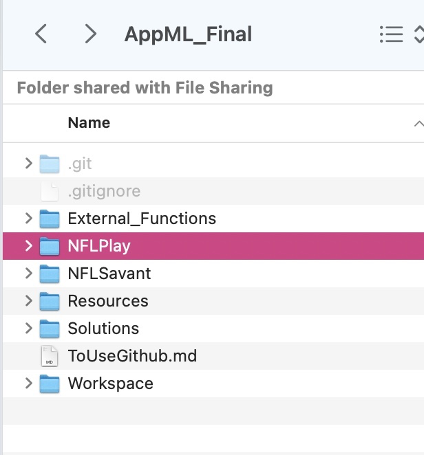

* update before you make change
```javascript
git pull
```

* apply your change
```javascript
git init .
git add .
git commit -m "whatever commit message"
git push -u origin main
```

* Setup(only once for the repo creation-already done)
``` javascript
git init . 
git add . 
git commit -m "whatever commit message"
git remote add origin https://github.com/KUcyans/AppML_Final.git
git push -u origin main
```

* For NFL data!!!!
  * make a dir and compress the .zip inside
  * The .csv should be located in `NFLPlay`
